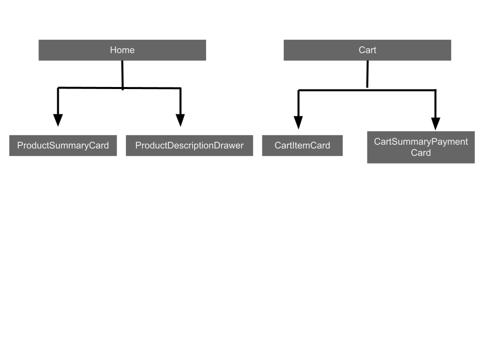
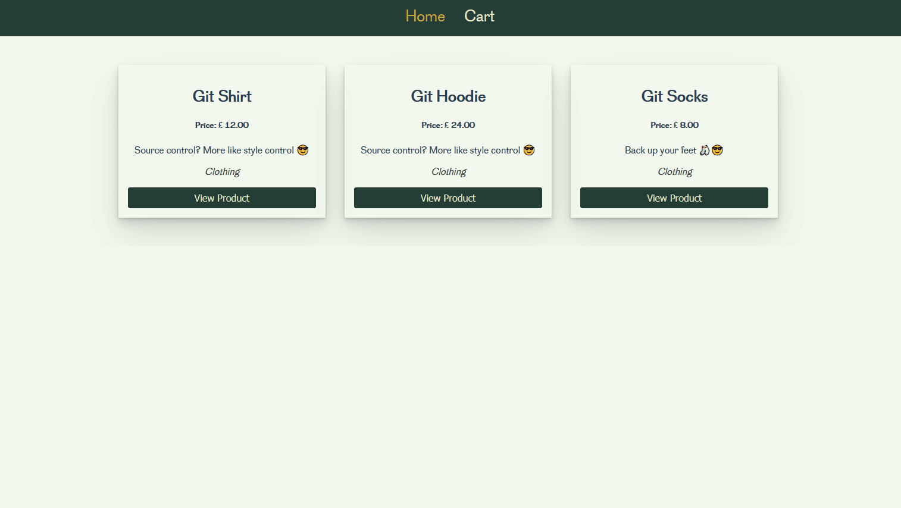

# shopping-create

## Component Architecture



## Key Features:

This project uses Vuex store and Vue router to create a shopping cart functionality for the frontend. It uses SCSS for styling.

Users can add products and see cart totals on the requisite page, with data persistence available via local storage.



## Things learnt/practiced:

1. Using Vuex store getters and mutations to manage state.
2. Using class bindings depending on a router name match so the active page can be styled appropriately in the nav.
3. Creating custom events using 'emit' to communicate between components and launch methods.

## Possible improvements:

1. Improve cart page styling for better readability.
2. Add clear cart functionality. 

## Project setup
```
npm install
```

### Compiles and hot-reloads for development
```
npm run serve
```

### Compiles and minifies for production
```
npm run build
```

### Lints and fixes files
```
npm run lint
```

### Customize configuration
See [Configuration Reference](https://cli.vuejs.org/config/).
